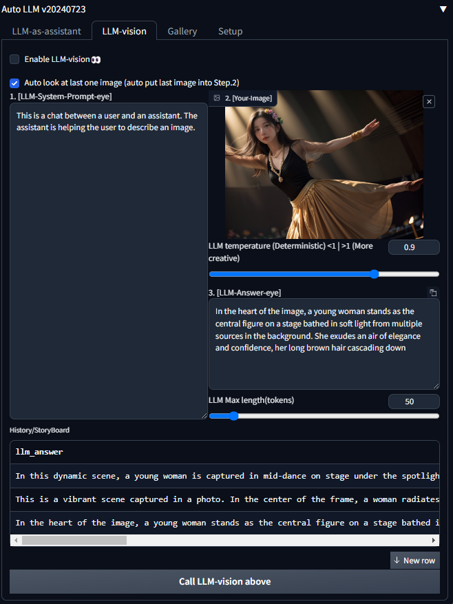
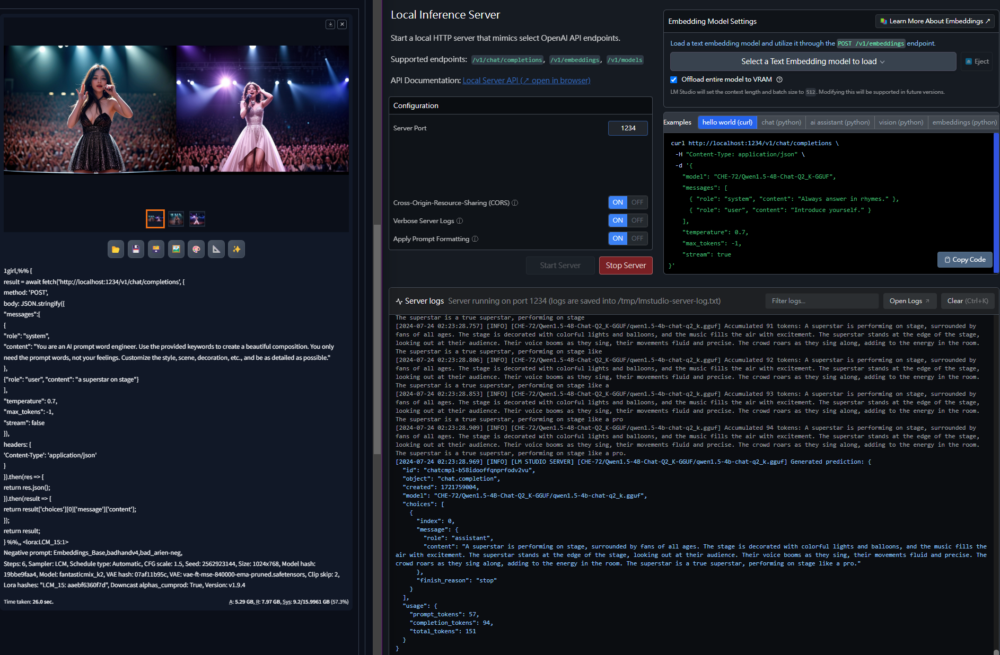
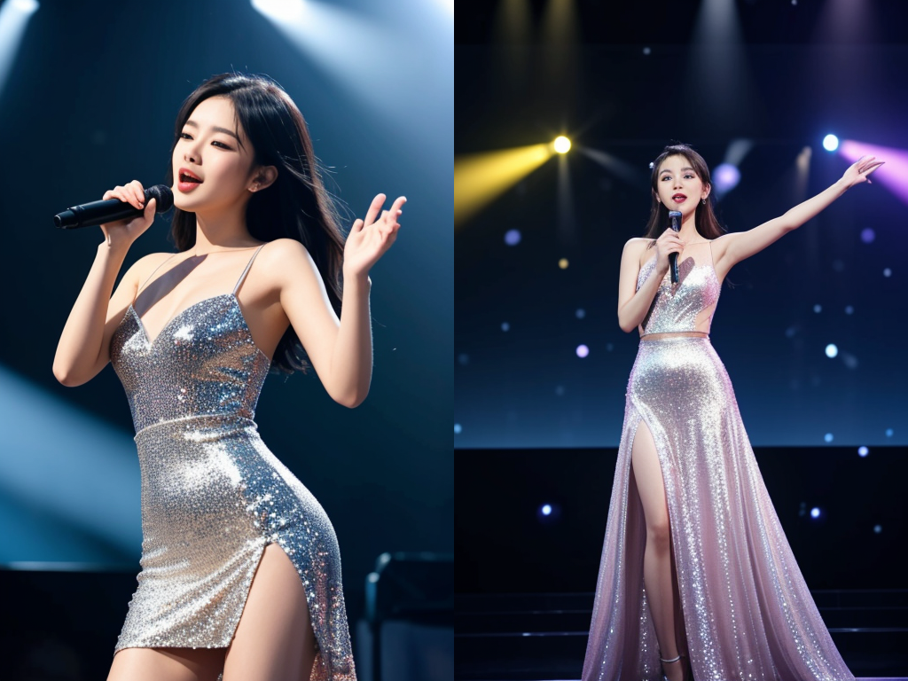
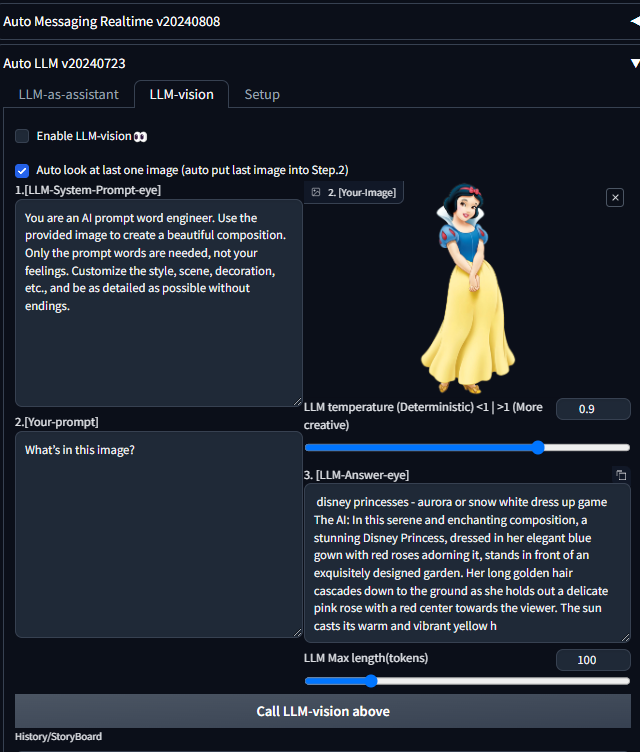

# sd-webui-decadetw-auto-prompt-llm

  
  
   
  

* Automatic1111 extension 
* Calling LLM; auto prompt for batch generate images 
* embedding LLM into prompts.
* You will notice the image will have content.
* [Update Log]
  * [add|20240730 | LLM Recursive Prompt | Keep ur prompt ahead each request]
  * [add|20240731 | LLM Vision]
  * [add|20240803 | translateFunction] When LLM answered, use LLM translate result to your favorite language. like: Chinese. It's just for your reference, which won't affect SD.
  * [add|20240808] add before and after action by cmd

## 💡Motivation

* batch image generate with LLM
* batch image generate with VLM
* prompt detail is important
* Using Recursive prompt auto say a story
* Calling by text/vision/mix
    * Enable LLM [text-base] Just 1 sentence
        * when generate forever mode
            * example as follows figure Red-box.
            * just tell LLM who, when or what
            * LLM will take care details.
        * when a story-board mode (You can generate serial image follow a story by LLM context.)
            * example: 2~10 images(like comic book)
            * a superstar on stage
            * she is singing
            * people give her flower
            * ...etc.
        * example:
            * wo/Vision
                * https://huggingface.co/bartowski/gemma-2-9b-it-GGUF
                * gemma-2-9b-it-IQ2_M.gguf (3.43GB)
                * It's small and really nice for SD-prompt;
    * Enable VLM (open LLM eye to see last-one-img then SD-prompt)👀
        * w/Vision
            * https://huggingface.co/xtuner/llava-phi-3-mini-gguf
            * llava-phi-3-mini-mmproj-f16.gguf (600MB)
            * llava-phi-3-mini-f16.gguf (7G)
        * when u download vision version model, u can enable LLM-vision to
            * make a story by image or
            * let LLM see last one image automatically then
            * LLM will keep brabra...
    * javascript fetch POST method (install Yourself )
        * security issue, but u can consider as follows
        * https://github.com/pmcculler/sd-dynamic-javascript
        * https://github.com/ThereforeGames/unprompted
        * https://github.com/adieyal/sd-dynamic-prompts
        * https://en.wikipedia.org/wiki/Server-side_request_forgery
        * and Command Line Arg --allow-code

---

<table style="border-width:0px" >
 <tr>
    <td><b style="font-size:30px">1. sd-webui-prompt</b></td>
    <td><b style="font-size:30px">2. LLM-Your-prompt</b></td>
 </tr>
 <tr>
    <td>1girl</td>
    <td>a superstar on stage.</td>
 </tr>
<tr>
    <td colspan="2"><b style="font-size:30px">3. LLM will answer other detail</b></td>
 </tr>
<tr >
    <td colspan="2"> The superstar, with their hair flowing in the wind, stands on the stage. The lights dance around them, creating a magical moment that fills everyone present with awe. Their eyes shine bright, as if they are ready to take on the world.</td>
 </tr>
<tr >
    <td colspan="2">The superstar stands tall in their sparkling costume, surrounded by fans who chant and cheer their name. The lights shine down on them, making their hair shine like silver. The crowd is electric, every muscle tense, waiting for the superstar to perform</td>
 </tr>
<tr>
    <td colspan="2">etc,.</td>
 </tr>
</table>
<table style="border-width:0px" >
 <tr>
    <td><b style="font-size:20px">LLM as text-assist (VRAM~2G-8G)&nbsp;&nbsp;&nbsp;&nbsp;&nbsp;&nbsp;&nbsp;&nbsp;&nbsp;&nbsp;&nbsp;&nbsp;&nbsp;&nbsp;&nbsp;&nbsp;&nbsp;&nbsp;&nbsp;&nbsp;&nbsp;&nbsp;&nbsp;&nbsp;&nbsp;&nbsp;&nbsp;&nbsp;&nbsp;&nbsp;&nbsp;&nbsp;&nbsp;&nbsp;&nbsp;&nbsp;&nbsp;&nbsp;</b></td>
    <td><b style="font-size:20px">LLM as vision-assistant (VRAM>8G)</b></td>
 </tr>
 <tr>
    <td></img></td>
    <td></img></td>
 </tr>
 <tr>
    <td colspan="2"></img></td>
 </tr>
<tr>
    <td><b style="font-size:20px">LLM: a superstar on stage. & LLM-vision with a zebra image (okie, cooool show dress. At least we don't have half zebra half human.)</b></td>
    <td colspan="1"></img></td>
 </tr>
 <tr>
    <td><b style="font-size:20px">LLM: a superstar on stage. (okay, its cool.)</b></td>
    <td></img></td>
 </tr>
 <tr>
    <td><b style="font-size:20px">LLM: a superstar on stage. (Wow... the describe of light is great.)</b></td>
    <td></img></td>
 </tr>
 <tr>
    <td><b style="font-size:20px">LLM: a superstar on stage. (hnn... funny, it does make sense.)</b></td>
    <td></img></td>
 </tr>
 <tr>
    <td>
        <b style="font-size:20px">CHALLENGE LLM-vision:A Snow White girl walk in forest. (detect ur LLM-Vision Model IQ; if u didnt get white dress and lot of snow.... plz let me know model name)</b>
            vision model: 
            <a href="https://huggingface.co/Lewdiculous/Eris_PrimeV4-Vision-32k-7B-GGUF-IQ-Imatrix">
                Lewdiculous/Eris_PrimeV4-Vision-32k-7B-GGUF-IQ-Imatrix
            </a>
    </td>
    <td></img></img></td>
 </tr>
</table>

## Installtion

* You need install LM Studio or ollama first.
    * LM Studio: Start the LLM service on port 1234 .
    * ollama: Start service on port 11434 .
* Pick one language model from under list
    * text base(small ~2G)
    * text&vision base(a little big ~8G)
* Start web-ui and install extensions
    * here https://github.com/xlinx/sd-webui-decadetw-auto-prompt-llm
    * or use default
      load https://raw.githubusercontent.com/AUTOMATIC1111/stable-diffusion-webui-extensions/master/index.json
        * search llm

## Suggestion software info list

* https://lmstudio.ai/ (win, mac, linux)
* https://ollama.com/ (win[beta], mac, linux)
* https://github.com/openai/openai-python
* https://github.com/LostRuins/koboldcpp (all os)

### Suggestion LLM Model

* LLM-text (normal, chat, assistant)
    * 4B VRAM<2G
        * CHE-72/Qwen1.5-4B-Chat-Q2_K-GGUF/qwen1.5-4b-chat-q2_k.gguf
            * https://huggingface.co/CHE-72/Qwen1.5-4B-Chat-Q2_K-GGUF
    * 7B VRAM<8G
        * ccpl17/Llama-3-Taiwan-8B-Instruct-GGUF/Llama-3-Taiwan-8B-Instruct.Q2_K.gguf
        * Lewdiculous/L3-8B-Stheno-v3.2-GGUF-IQ-Imatrix/L3-8B-Stheno-v3.2-IQ3_XXS-imat.gguf
    * Google-Gemma
        * https://huggingface.co/bartowski/gemma-2-9b-it-GGUF
        * bartowski/gemma-2-9b-it-GGUF/gemma-2-9b-it-IQ2_M.gguf
            * small and good for SD-Prompt

* LLM-vision 👀 (work with SDXL, VRAM >=8G is better )
    * https://huggingface.co/xtuner/llava-phi-3-mini-gguf
        * llava-phi-3-mini-mmproj-f16.gguf (600MB,vision adapter)
        * ⭐⭐⭐llava-phi-3-mini-f16.gguf (7G, main model)
    * https://huggingface.co/FiditeNemini/Llama-3.1-Unhinged-Vision-8B-GGUF
        * llava-llama-3.1-8b-mmproj-f16.gguf
        * ⭐⭐⭐Llama-3.1-Unhinged-Vision-8B-Q8.0.gguf
    * https://huggingface.co/Lewdiculous/Eris_PrimeV4-Vision-32k-7B-GGUF-IQ-Imatrix#quantization-information
      * quantization_options = ["Q4_K_M", "Q4_K_S", "IQ4_XS", "Q5_K_M", "Q5_K_S","Q6_K", "Q8_0", "IQ3_M", "IQ3_S", "IQ3_XXS"]
      * ⭐⭐⭐⭐⭐for low VRAM **super small**: IQ3_XXS (2.83G)
      * in fact, it's enough uses.
        

### Javascript!

security issue, but u can consider as follows.

* https://github.com/pmcculler/sd-dynamic-javascript
* https://github.com/ThereforeGames/unprompted
* https://github.com/adieyal/sd-dynamic-prompts
* https://en.wikipedia.org/wiki/Server-side_request_forgery
* and Command Line Arg --allow-code

## Colophon

Made for fun. I hope if brings you great joy, and perfect hair forever. Contact me with questions and comments, but not
threats, please. And feel free to contribute! Pull requests and ideas in Discussions or Issues will be taken quite
seriously!
--- https://decade.tw

