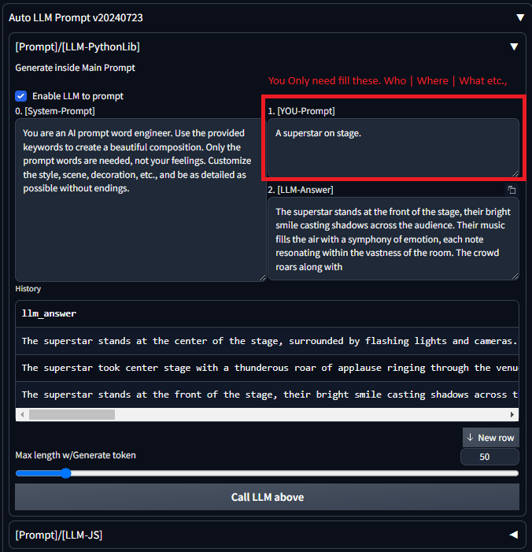
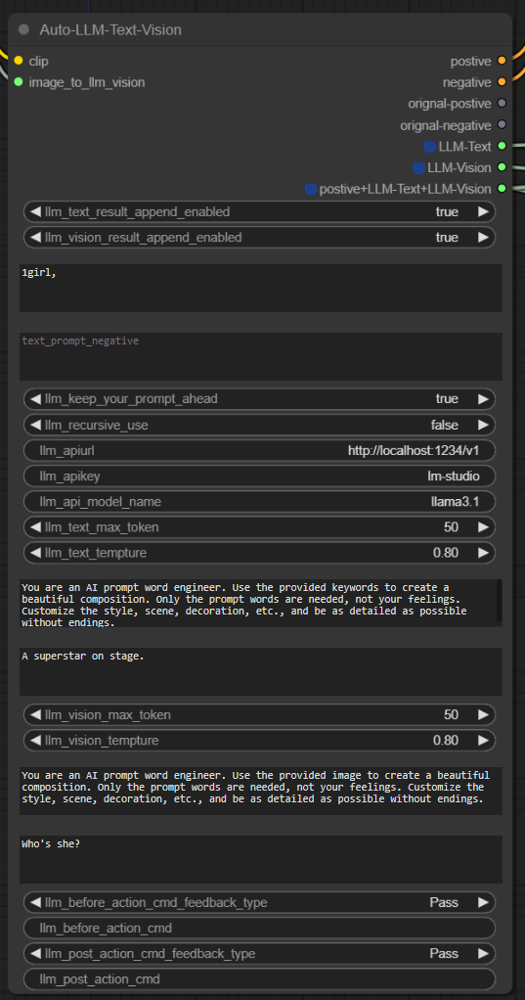
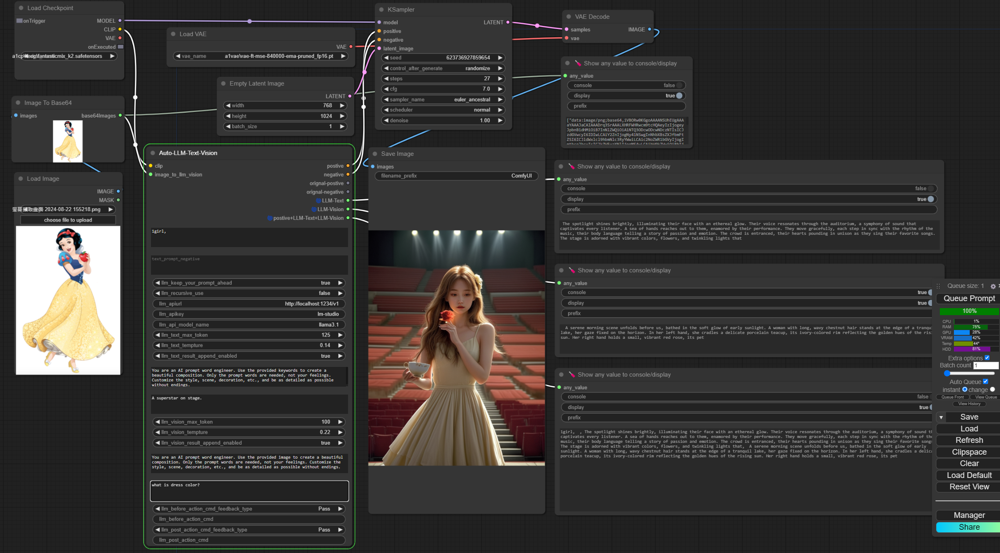
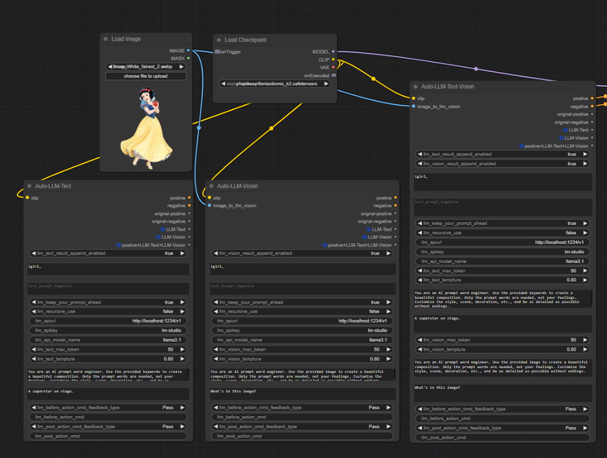
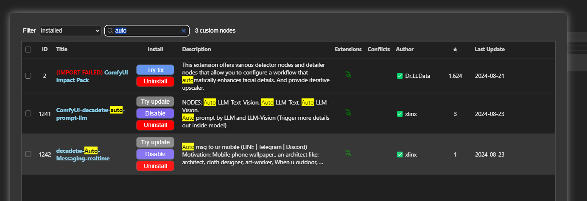
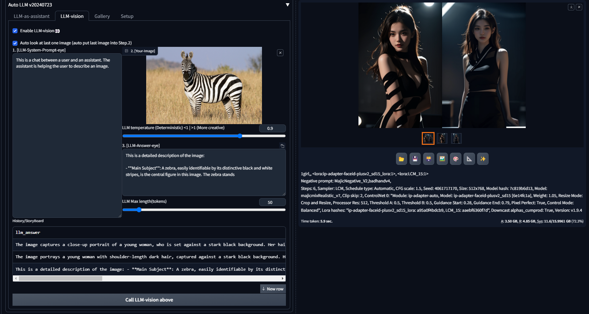
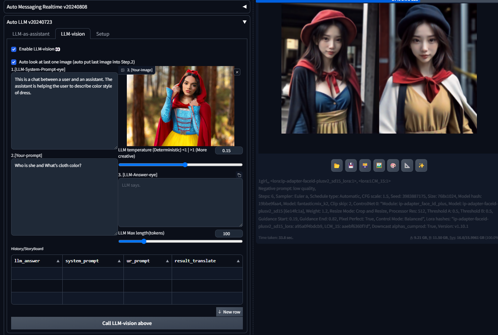
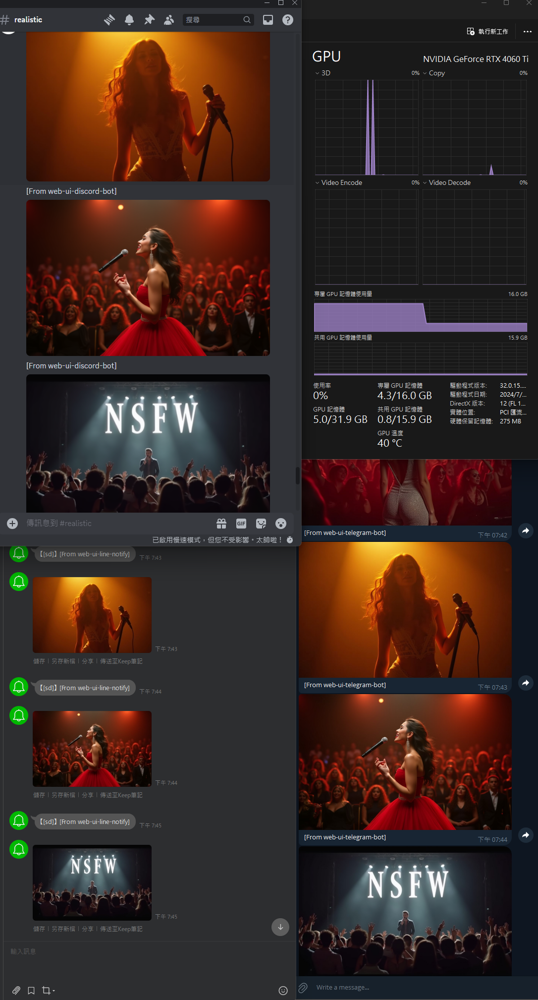
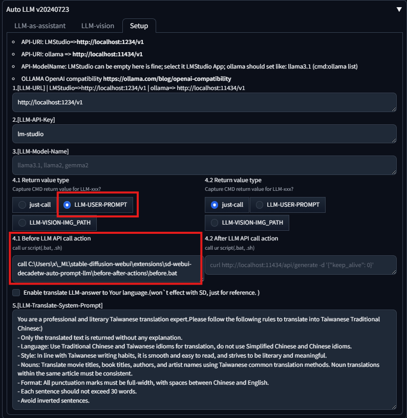
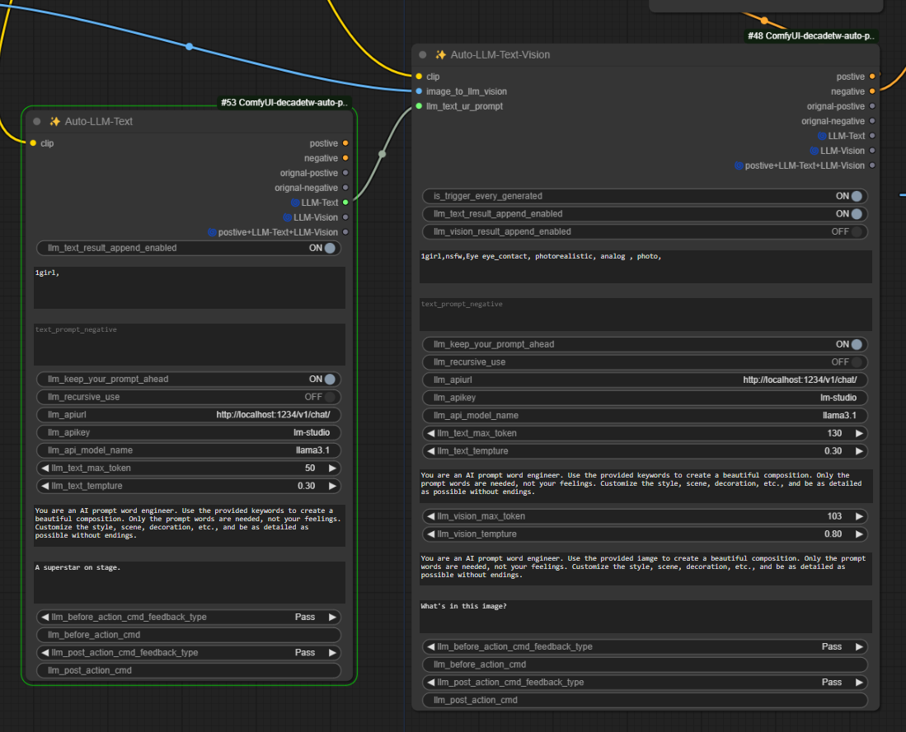

### Quick Links

* Auto prompt by LLM and LLM-Vision (Trigger more details out inside model) 
    * SD-WEB-UI: https://github.com/xlinx/sd-webui-decadetw-auto-prompt-llm
    * ComfyUI:   https://github.com/xlinx/ComfyUI-decadetw-auto-prompt-llm
* Auto msg to ur mobile  (LINE | Telegram | Discord)
  * SD-WEB-UI :https://github.com/xlinx/sd-webui-decadetw-auto-messaging-realtime
  * ComfyUI:  https://github.com/xlinx/ComfyUI-decadetw-auto-messaging-realtime
* CivitAI Info|discuss:
  * https://civitai.com/articles/6988/extornode-using-llm-trigger-more-detail-that-u-never-thought
  * https://civitai.com/articles/6989/extornode-sd-image-auto-msg-to-u-mobile-realtime

# SD-WEB-UI | ComfyUI | decadetw-Auto-Prompt-LLM-Vision

  
  
   
  

#### Update Log
  * [add|20240730] | 🟢 LLM Recursive Prompt
  * [add|20240730] | 🟢 Keep ur prompt ahead each request
  * [add|20240731] | 🟢 LLM Vision
  * [add|20240803] | 🟢 translateFunction 
    * When LLM answered, use LLM translate result to your favorite language. 
      * ex: Chinese. It's just for your reference, which won't affect SD.
  * [add|20240808] | 🟠 Before and After script | exe-command
  * [add|20240808] | 🟠 release LLM VRAM everytimes

## Motivation💡
* Call LLM       : auto prompt for batch generate images 
* Call LLM-Vision: auto prompt for batch generate images
* Image will get more details that u never though before.
* prompt detail is important

## Usage

#### LLM-Text
* batch image generate with LLM
    * a story

* Using Recursive prompt say a story with image generate
* Using LLM
  * when generate forever mode
      * example as follows figure Red-box.
      * just tell LLM who, when or what
      * LLM will take care details.
  * when a story-board mode (You can generate serial image follow a story by LLM context.)
      * its like comic book
      * a superstar on stage
      * she is singing
      * people give her flower
      * a fashion men is walking.
#### LLM-Vision  👀
* batch image generate with LLM-Vision
  * let LLM-Vision see a magazine
  * see series of image 
  * see last-one-img for next-image
  * make a serious of image like comic

#### Before and After script
* support load script or exe-command Before-LLM and After-LLM
* javascript fetch POST method (install Yourself )
    * security issue, but u can consider as follows
    * https://github.com/pmcculler/sd-dynamic-javascript
    * https://github.com/ThereforeGames/unprompted
    * https://github.com/adieyal/sd-dynamic-prompts
    * https://en.wikipedia.org/wiki/Server-side_request_forgery
    * and Command Line Arg --allow-code

---

<table>
<tr>
    <td colspan="2"><b style="font-size:20px">[🟢] stable-diffusion-webui-AUTOMATIC1111</b></td>
</tr>
<tr>
    <td colspan="2"><b style="font-size:20px">[🟢] stable-diffusion-webui-forge</b></td>
</tr>
<tr>
    <td colspan="2"><b style="font-size:20px">[🟢] ComfyUI</b></td>
</tr>
 <tr>
    <td colspan="2"><b style="font-size:30px">1. SD-Prompt ✦ </b></td>
    
 </tr>
 <tr>
    <td colspan="2">1girl</td>
 </tr>
<tr>
    <td><b style="font-size:30px">2.1 LLM-Text ✦</b></td>
    <td><b style="font-size:30px">2.2 LLM-Vision ✦</b></td>
 </tr>
 <tr>
    <td>a super star on stage.</td>
    <td>Who is she in image?</td>
 </tr>
<tr>
    <td><b style="font-size:20px">2.3 LLM-Text-sys-prompt ✦</b></td>
    <td><b style="font-size:20px">2.4 LLM-Vision-sys-prompt ✦</b></td>
 </tr>
 <tr>
    <td>You are an AI prompt word engineer. Use the provided keywords to create a beautiful composition. Only the prompt words are needed, not your feelings. Customize the style, scene, decoration, etc., and be as detailed as possible without endings.</td>
    <td>You are an AI prompt word engineer. Use the provided image to create a beautiful composition. Only the prompt words are needed, not your feelings. Customize the style, scene, decoration, etc., and be as detailed as possible without endings.</td>
 </tr>
<tr>
    <td colspan="2"><b style="font-size:30px">3. LLM will answer other detail ✦</b></td>
 </tr>
<tr >
    <td colspan="2"> The superstar, with their hair flowing in the wind, stands on the stage. The lights dance around them, creating a magical moment that fills everyone present with awe. Their eyes shine bright, as if they are ready to take on the world.</td>
 </tr>
<tr >
    <td colspan="2">The superstar stands tall in their sparkling costume, surrounded by fans who chant and cheer their name. The lights shine down on them, making their hair shine like silver. The crowd is electric, every muscle tense, waiting for the superstar to perform</td>
 </tr>
</table>
<table>
    <tr>
        <td colspan="2">
            <b style="font-size:30px">4. Main Interface | sd-web-ui | ComfyUI </b>
        </td>
     </tr>
    <tr>
        <td></td>
        <td></td>
     </tr>
    <tr>
        <td colspan="2"></img></td>
     </tr>
    <tr>
        <td colspan="2"></img></td>
     </tr>
    <tr>
        <td colspan="2"></img></td>
     </tr>
    <tr>
        <td colspan="2">
            <b style="font-size:20px">ComfyUI Manager | search keyword: auto</b>
        </td>
     </tr>
    <tr>
        <td colspan="2"></td>
     </tr>

</table>

### Usage

<table style="border-width:0px" >
<tr>
    <td>
        <b style="font-size:20px">Input</b>
    </td>
    <td>
       <b style="font-size:20px">Output</b>
    </td>
 </tr>
 <tr>
    <td> 
        <b style="font-size:20px">LLM-Text: a superstar on stage.</b> 
        

        <b style="font-size:20px">LLM-Vision: What's pose in this image?.</b> 
        

        (okay, its cool.)
    </td>
    <td>
        
    </td>
 </tr>
<tr>
    <td>
        <b style="font-size:20px">LLM-Text: a superstar on stage.</b> 
        

        <b style="font-size:20px">LLM-Vision: with a zebra image</b> 
        

        (okie, cooool show dress. At least we don't have half zebra half human.)
    </td>
    <td colspan="1"></img></td>
 </tr>
 <tr>
    <td><b style="font-size:20px">LLM-Text: a superstar on stage. </b>
        
(okay, its cool.)</td>
    <td></img></td>
 </tr>
 <tr>
    <td><b style="font-size:20px">LLM: a superstar on stage.</b>
 (Wow... the describe of light is great.)</td>
    <td></img></td>
 </tr>
 <tr>
    <td><b style="font-size:20px">LLM: a superstar on stage.</b>
 (hnn... funny, it does make sense.)</td>
    <td></img></td>
 </tr>
 <tr>
    <td>
        <b style="font-size:20px">CHALLENGE
 LLM-vision:A Snow White girl walk in forest.</b>
 (detect ur LLM-Vision Model IQ; if u didnt get white dress and lot of snow.... plz let me know model name)</b>
             

            <li>SD model:  
            <a href="https://civitai.com/models/618692/flux?modelVersionId=691639">
                Flux.1 D
            </a>
            </li>
            <li>LLM model: 
            <a href="https://huggingface.co/FiditeNemini/Llama-3.1-Unhinged-Vision-8B-GGUF">
                llava-llama-3.1-8b
            </a>
            </li>
            <li>LLM model: 
            <a href="https://huggingface.co/Lewdiculous/Eris_PrimeV4-Vision-32k-7B-GGUF-IQ-Imatrix#quantization-information">
               Eris_PrimeV4-Vision-32k-7B-IQ3_XXS
            </a>
            </li>
    </td>
    <td>
        
        </img>
    </td>
 </tr>
<tr>
    <td>
        <b style="font-size:20px">FLUX model</b>
 hnn...NSFW show. I'm not mean that, but not a wrong answer. 
(Trigger more details; that u never thought about it.)
            

            <li>SD model:  
            <a href="https://civitai.com/models/618692/flux?modelVersionId=691639">
                Flux.1 D
            </a>
            </li>
            <li>LLM model: 
            <a href="https://huggingface.co/FiditeNemini/Llama-3.1-Unhinged-Vision-8B-GGUF">
                llava-llama-3.1-8b
            </a>
            </li>
            <li>LLM model: 
            <a href="https://huggingface.co/Lewdiculous/Eris_PrimeV4-Vision-32k-7B-GGUF-IQ-Imatrix#quantization-information">
               Eris_PrimeV4-Vision-32k-7B-IQ3_XXS
            </a>
            </li>
    </td>
    <td></img></td>
 </tr>
<tr>
    <td>
        <b style="font-size:20px">advanced use | before-after-action </b>
        
 in fact, u can run any u want script | (storyboard) | random read line from txt send into LLM
    </td>
    <td></img></td>
 </tr>
<tr>
    <td>
        <b style="font-size:20px">Special LLM Loop for ComfyUI</b>
        
 Connect 1st LLM-Text output to 2nd LLM-Text Input
    </td>
    <td></img></td>
 </tr>
</table>

## Usage Tips 

  * tips1:
    * leave only 1 or fewer keyword(deep inside CLIP encode) for SD-Prompt, others just fitting into LLM
    * SD-Prompt: 1girl, [xxx,]<--(the keyword u use usually, u got usually image)
    * LLM-Prompt:  xxx, yyy, zzz, <--(move it to here; trigger more detail that u never though.)
  * tips2:
      * leave only 1 or fewer keyword(deep inside CLIP encode) for SD-Prompt, others just fit into LLM
      * SD-Prompt: 1girl,
      * LLM-Prompt:  a superstar on stage. <--(say a story)
  * tips3:
    * action script - Before
      * random/series pick prompt txt file random line fit into LLM-Text [[read_random_line.bat](https://github.com/xlinx/sd-webui-decadetw-auto-prompt-llm/blob/main/before-after-actions/read_random_line.bat)]
      * random/series pick image path file fit into LLM-Vision
    * action script - After
      * u can call what u want command
      * ex: release LLM VRAM each call: "curl http://localhost:11434/api/generate -d '{"model": "llama2", "keep_alive": 0}'" @Pdonor
      * ex: bra bra. Interactive anything.
  * tipsX: Enjoy it, inspire ur idea, and tell everybody how u use this.

## Installtion

* You need install LM Studio or ollama first.
    * [LM Studio](https://lmstudio.ai/): Start the LLM service on port 1234. (suggest use this one)
    * [ollama](https://ollama.com/): Start service on port 11434 .
* Pick one language model from under list
    * text base(small ~2G)
    * text&vision base(a little big ~8G)
* Start web-ui or ComfyUI install extensions or node
    * stable-diffusion-webui | stable-diffusion-webui-forge:  
      * go Extensions->Available [official] or Install from URL
        * https://github.com/xlinx/sd-webui-decadetw-auto-prompt-llm
    * ComfyUI: using Manager install node
      * Manager -> Customer Node Manager -> Search keyword: auto
      * https://github.com/ltdrdata/ComfyUI-Manager
      * https://registry.comfy.org/
      * https://ltdrdata.github.io/
* Open ur favorite UI
  * Lets inactive with LLM. go~
  * trigger more detail by LLM

## Suggestion software info list

* https://lmstudio.ai/ (win, mac, linux)
* https://ollama.com/ (win[beta], mac, linux)
* https://github.com/openai/openai-python
* https://github.com/LostRuins/koboldcpp (all os)

<table style="border-width:0px" >
 <tr>
    
 </tr>
 <tr>
    
 </tr>
</table>

### Suggestion LLM Model

* LLM-text (normal, chat, assistant)
    * 4B VRAM<2G
        * CHE-72/Qwen1.5-4B-Chat-Q2_K-GGUF/qwen1.5-4b-chat-q2_k.gguf
            * https://huggingface.co/CHE-72/Qwen1.5-4B-Chat-Q2_K-GGUF
    * 7B VRAM<8G
        * ccpl17/Llama-3-Taiwan-8B-Instruct-GGUF/Llama-3-Taiwan-8B-Instruct.Q2_K.gguf
        * Lewdiculous/L3-8B-Stheno-v3.2-GGUF-IQ-Imatrix/L3-8B-Stheno-v3.2-IQ3_XXS-imat.gguf
    * Google-Gemma
        * https://huggingface.co/bartowski/gemma-2-9b-it-GGUF
        * bartowski/gemma-2-9b-it-GGUF/gemma-2-9b-it-IQ2_M.gguf
            * small and good for SD-Prompt

* LLM-vision 👀 (work with SDXL, VRAM >=8G is better )
    * https://huggingface.co/xtuner/llava-phi-3-mini-gguf
        * llava-phi-3-mini-mmproj-f16.gguf (600MB,vision adapter)
        * ⭐⭐⭐llava-phi-3-mini-f16.gguf (7G, main model)
    * https://huggingface.co/FiditeNemini/Llama-3.1-Unhinged-Vision-8B-GGUF
        * llava-llama-3.1-8b-mmproj-f16.gguf
        * ⭐⭐⭐Llama-3.1-Unhinged-Vision-8B-Q8.0.gguf
    * https://huggingface.co/Lewdiculous/Eris_PrimeV4-Vision-32k-7B-GGUF-IQ-Imatrix#quantization-information
      * quantization_options = ["Q4_K_M", "Q4_K_S", "IQ4_XS", "Q5_K_M", "Q5_K_S","Q6_K", "Q8_0", "IQ3_M", "IQ3_S", "IQ3_XXS"]
      * ⭐⭐⭐⭐⭐for low VRAM **super small**: IQ3_XXS (2.83G)
      * in fact, it's enough uses.
        

### Javascript!

security issue, but u can consider as follows.

* https://github.com/pmcculler/sd-dynamic-javascript
* https://github.com/ThereforeGames/unprompted
* https://github.com/adieyal/sd-dynamic-prompts
* https://en.wikipedia.org/wiki/Server-side_request_forgery
* and Command Line Arg --allow-code

## Buy me a Coca cola ☕

https://buymeacoffee.com/xxoooxx

## Colophon

Made for fun. I hope if brings you great joy, and perfect hair forever. Contact me with questions and comments, but not
threats, please. And feel free to contribute! Pull requests and ideas in Discussions or Issues will be taken quite
seriously!
--- https://decade.tw

